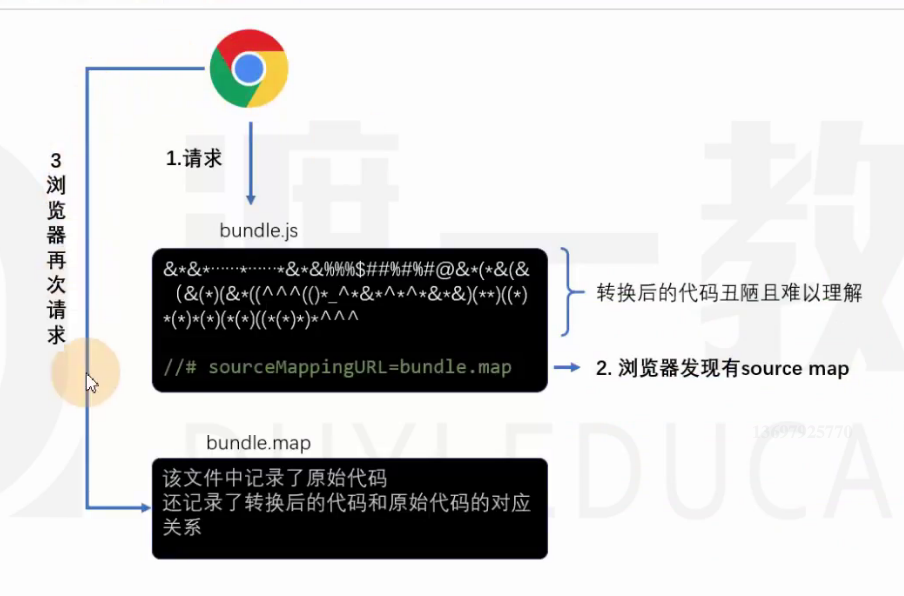
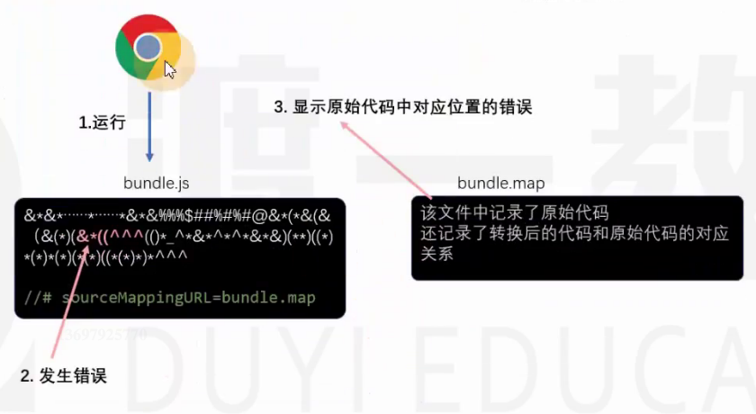
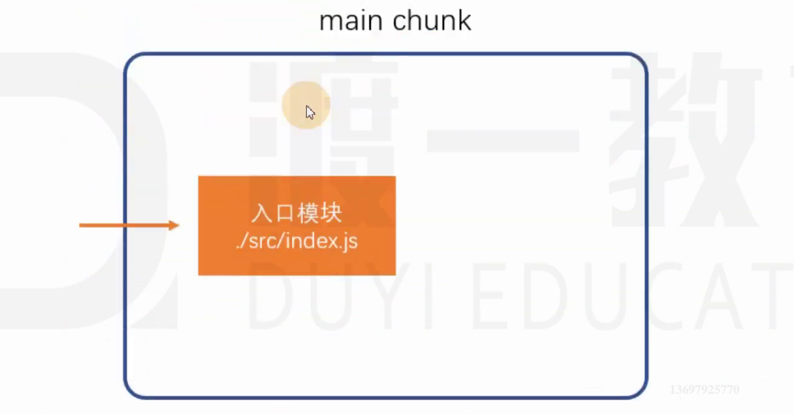
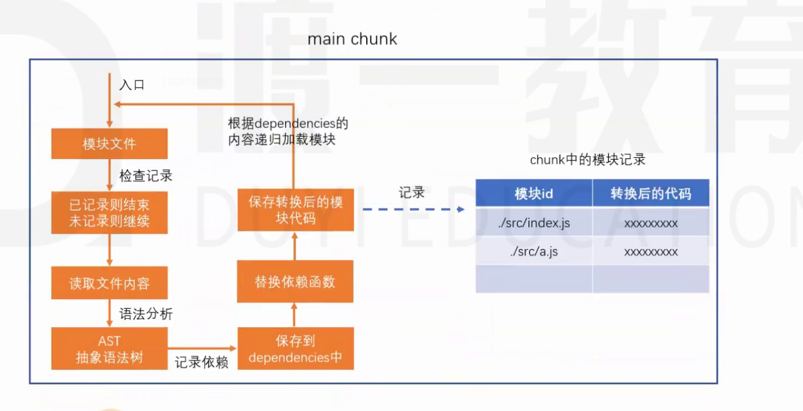

## 浏览器端端的模块化

### 问题

- 效率问题：精细的模块划分带来了更多的JS文件，更多的JS文件带来了更多的请求，降低了页面访问效率
- 兼容性问题：浏览器目前仅支持ES6的模块化标准，并且还存在兼容性问题
- 工具问题：浏览器不支持npm下载的第三方包

这些仅仅是前端工程化的一个缩影

当开发一个具有规模的程序，你讲遇到非常多的非业务问题，这些问题包括：执行效率，兼容性、代码的可维护性、可扩展性、团队协作、测试等等，我们将这些问题称之为工程问题。工程问题与业务无关，但它深刻的影响到开发进度，如果没有一个好的工具解决这些问题，将使得开发进度变得极其缓慢，同时也让开发者陷入技术的泥潭。

### 根本原因

思考：上面提到的问题，为什么在node端就没有那么明显，反而到了浏览器端就变得如此严重呢？

答：在node端，运行的JS文件再本地，因此可以本地读取文件，它的效率比浏览器远程传输文件高得多。

根本原因：在浏览器端，开发时态（devtime）和运行时态（runtime）的侧重点不一样。

开发时态：

1. 模块划分越细越好
2. 支持多种模块化标准
3. 支持npm或者其他包管理下载的模块
4. 能够解决其他工程化的问题

运行时态：

1. 文件越少越好
2. 文件体积越小越好
3. 代码内容越乱越好
4. 所有浏览器都能够兼容
5. 能够解决其他运行时的问题，主要是执行效率问题

这种差异在小项目中表现并不明显，可是一旦项目形成规模，就越来越明显，如果不解决这些问题，前端项目形成规模只能是空谈。

### 解决办法

既然开发时态和运行时态面临的局面有巨大的差异，因此，我们需要有一个工具，这个工具能够让开发者专心在开发时态写代码，然后利用这个工具将开发时态编写的代码转换为运行时态需要的东西。

这样的东西，叫做构建工具。

这样一来，开发者就可以专注于开发时态的代码结构，而不用担心运行时态遇到的问题了。

### 常见的构建工具

- webpack
- grunt
- gulp
- browserify
- fis
- 其它

---

## Webpack

### 简介

webpack是基于模块化的打包（构建）工具，它把一切视为模块，它通过一个开发时态的入口模块为起点，分析出所有的依赖关系，然后经过一系列过程（压缩、合并），最终生成运行时态的文件。

### 特点

- 为前端工程化而生：webpack致力于解决前端工程化，特别是浏览器端工程化中遇到的问题，让开发者集中注意力写业务代码，而把工程化过程中的问题全部交给webpack来处理。
- 简单易用：支持零配置，可以不用写任何一行额外的代码就使用webpack
- 强大的生态：webpack是非常灵活，可以扩展的，webpack本身的功能并不多，但是它提供了一些可以扩展其功能的机制，使得一些第三方库可以融入到webpack中。
- 基于nodejs：由于webapck在构建工程中需要读取文件，因此它是运行在node环境中的
- 基于模块化：webpack在构建过程中要分析依赖关系，方式是通过模块化导入语句进行分析的，它支持各种模块化标准，包括但不限于CommonJS、ES6 Module

### 安装

```bash
# -D 开发依赖
npm i -D webpack webpack-cli 
```

webapck通过npm安装，它提供了两个包：

- webpack：核心包，包含了webpack构建过程中要用到的所有的api
- webpack-cli：提供了一个简单的cli命令，它调用了webpack核心包的api，来完成构建过程

安装方式：

- 全局安装：可以全局使用webpack命令，但是无法为不同项目对应不同的webpack版本
- 本地安装：推荐，每个项目都使用自己的webpack版本进行构建

### 使用

```bash
npx webpack
```


默认情况下，webpack会以`./src/index.js`作为入口文件分析依赖关系，打包到`./dist/main.js`文件中

摸过`--mode`选项可以控制webpack的打包结果的运行环境，不指定，默认是生产环境。

```bash
npx webpack --mode=development
npx webpack --mode=production
```

### 模块化兼容性

由于webpack同时支持CommonJS和ES6 module，因此需要理解它们互操作时webpack是如何处理的。

1. 同一种模块化标准

如果导出导入使用的是同一种模块化标准，打包后的效果和之前学习的模块化没有任何差异。

2. 不同种模块化标准

不同的模块化标准，webpack按照如下的方式处理

```js
// ES6 export
export var a = 1;
export var b = 2;
export default 3;

// CommonJS import
require('./a')
{
  a: 1,
  b: 2,
  default: 3,
}
  
// CommonJS export
module.exports = {
  a: 1,
  b: 2,
  c: 3,
}
  
// ES6 import
import * as obj from './a' 
{
  a: 1,
  b: 2,
  c: 3,
}
```

3. 最佳实践

代码编写最忌讳的是精神分裂，选择一个合适的模块化标准，然后贯彻整个开发阶段。


## 配置


### source map

source map（源码地图）和webpack无关。

前端发展到现阶段，很多时候都不会直接运行源代码，可能需要对源码进行合并、压缩、转换等操作，真正运行的是转换后的代码。

```
1.js + 2.js + 3.ts => bundle.js （合并压缩后的代码）
```

这就给调试带来了困难，因为当运行发生错误的时候，我们更加希望能看到源码中的错误，而不是转换后代码的错误。

为了解决这一问题，chrome浏览器率先支持了source map，其它浏览器纷纷效仿，目前，几乎所有新版浏览器都支持了source map。

source map实际上是一个配置，配置中不仅记录了所有源码的内容，还记录了和转换后的代码的对应关系。

下面是浏览器处理source map的原理：



---



最佳实践：

1. source map应在开发环境中使用，作为一种调试手段
2. source map不应该在生产环境中使用，source map的文件一般较大，不仅会导致额外的网络传输，还容易暴露原始代码，即便要在生产环境中使用source map，用于调试真实的代码运行问题，也要做出一些处理规避网络传输和代码暴露的问题。

### devtool

devtool配置项用于设置webpack中的source map形式, 使用webpack编译后的代码难以调试，可以通过devtool配置来优化调试体验

文档： https://www.webpackjs.com/configuration/devtool/#devtool


## webpack 编译过程

webpack 的作用是将源代码编译（构建、打包）成最终代码

整个编译过程大致分为三个过程

1. 初始化
2. 编译
3. 输出

### 初始化

此阶段，webpack会将cli参数、配置文件、默认配置进行融合，形成一个最终的配置对象。

对配置的的处理过程是依托一个第三方库yargs完成的

此阶段相对比较简单，主要是为接下来的编译阶段做必要的准备

目前，可以简单的理解为，初始化阶段主要用于生成一个最终的配置对象

### 编译

1. 创建chunk

chunk是webpack在内部构建过程中的一个重要概念，译为`块`，它表示通过某个入口找到所有依赖的统称。

根据入口模块（默认为./src/index.js）创建一个chunk，由于入口有可能为多个，所以chunk也可能对应多个。



每个chunk都至少有两个属性：

- name：默认为main
- id：唯一编号，开发环境和name相同，生产环境是一个数字，从0开始

2. 构建所有的依赖模块



